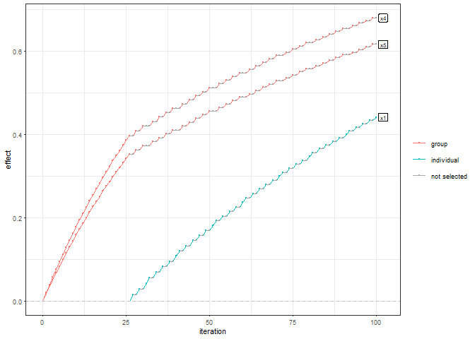

<!-- README.md is generated from README.Rmd. Please edit that file -->

# sgboost

<!-- badges: start -->
<!-- badges: end -->

`sgboost` implements the sparse group boosting using the `mboost`
package. A formula object defining group baselearners and individual
baselearners are being used in the fitting process. They are regularized
based on the degrees of freedom of an individual baselearner
$df(\lambda)$ and the ones of a group baselearner $df(\lambda^{(g)})$,
such that $$
df(\lambda) = \alpha, 
$$ $$
df(\lambda^{(g)}) = 1- \alpha.
$$ \## Installation

You can install the development version of sgboost from
[GitHub](https://github.com/) with:

``` r
# install.packages("devtools")
devtools::install_github("FabianObster/sgboost")
```

## Example

This is a basic example which shows you how to solve a common problem:

``` r
library(sgboost)
library(dplyr)
#> 
#> Attache Paket: 'dplyr'
#> Die folgenden Objekte sind maskiert von 'package:stats':
#> 
#>     filter, lag
#> Die folgenden Objekte sind maskiert von 'package:base':
#> 
#>     intersect, setdiff, setequal, union
library(mboost)
#> Lade nötiges Paket: parallel
#> Lade nötiges Paket: stabs
```

For a dataframe `df` and a group structure `group_df`, this example fits
a sparse-group boosting model and plots the coefficient path:

``` r
library(sgboost)
set.seed(1)
df <- data.frame(
 x1 = rnorm(100), x2 = rnorm(100), x3 = rnorm(100),
 x4 = rnorm(100), x5 = runif(100)
)
df <- df %>%
 mutate_all(function(x) {
   as.numeric(scale(x))
 })
df$y <- df$x1 + df$x4 + df$x5
group_df <- data.frame(
 group_name = c(1, 1, 1, 2, 2),
 var_name = c("x1", "x2", "x3", "x4", "x5")
)

sgb_formula <- as.formula(create_formula(alpha = 0.3, group_df = group_df))
sgb_model <- mboost(formula = sgb_formula, data = df)
plot_path(sgb_model)
```


